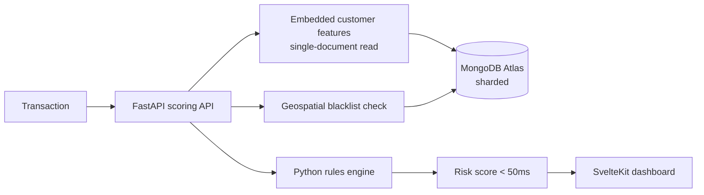

<!-- Portfolio repository -->

> **Real-Time Fraud Detection POC** — portfolio demonstration.
> Sub-50ms scoring with FastAPI, SvelteKit, and MongoDB Atlas
>
> This is a sanitized public version of a real-world prototype. Client names,
> credentials, internal endpoints, and proprietary assets have been removed; all
> configuration is environment-driven (`.env.example`). Authored by
> [Paul Cleenewerck](https://github.com/pcleene).

---

# Regional Bank Fraud Detection — Reference Implementation

Fraud detection reference implementation demonstrating MongoDB Atlas as a consolidated replacement for Redis (36 shards) + Oracle. The system scores transactions in <50ms end-to-end using embedded customer features, geospatial blacklist checks, and a Python rules engine.

**Stack:** FastAPI (Python 3.11) + async PyMongo + SvelteKit + MongoDB Atlas

## Headline results

| Metric | Result |
|--------|--------|
| End-to-end scoring latency | **< 50 ms** |
| Sustained throughput (load-tested) | **~26K TPS** |
| Scale validated | **50M customers · 100M transactions** |
| Platforms consolidated | Redis (36 shards) + Oracle → **single Atlas cluster** |

## Architecture



## Quick Start

### Prerequisites

- Python 3.11+
- Node.js 20+
- MongoDB Atlas cluster (M30+ for sharding)
- mongosh CLI (for Atlas setup)

### 1. Install Dependencies

```bash
make install
```

### 2. Configure Atlas Connection

Edit `backend/.env` with your Atlas connection string:

```bash
# For Atlas with PrivateLink (EC2 deployment)
MONGODB_URI=mongodb+srv://<user>:<password>@<cluster>.mongodb.net/<db>

# Or standard Atlas connection
MONGODB_URI=mongodb+srv://<user>:<password>@<cluster>.mongodb.net/<db>
```

### 3. Setup Atlas (Indexes + Sharding)

```bash
# Run the Atlas setup script
mongosh "mongodb+srv://<user>:<password>@<cluster>.mongodb.net/<db>" < scripts/atlas-setup.js

# Or use make (will prompt for connection string)
make atlas-setup
```

### 4. Seed Test Data

```bash
# Quick test (5 customers, 20 transactions) - schema validation only
make seed-test

# Small test dataset (10k customers, 50k transactions)
make seed

# Medium dataset (100k customers, 500k transactions)
make seed-medium

# Full POC scale (50M customers, 100M transactions) - takes 2-3 hours
make seed-full
```

### 5. Run Development Servers

```bash
make dev
```

- API: http://localhost:8000
- Frontend: http://localhost:3000
- API Docs: http://localhost:8000/docs

## AWS Production Deployment

For production deployment with high availability and 10K+ TPS capacity, use Terraform to deploy:

- **Application Load Balancer** (internet-facing)
- **EC2 Auto Scaling Group** (configurable: c6i.2xlarge to c6i.16xlarge)
- **MongoDB Atlas PrivateLink** (low-latency private connection)
- **VPC with public/private subnets** (2 AZs)

> **POC Configuration:** The 10K+ TPS results were achieved with 2× c6i.16xlarge (64 vCPU each) + M60 Atlas (3 shards). See [Performance](#performance) section for details.

### Quick Deploy

```bash
# 1. Configure variables
cd terraform && cp prod.tfvars.example prod.tfvars
# Edit prod.tfvars with your Atlas and AWS settings

# 2. Deploy (~5-10 minutes)
make tf-init
make tf-plan
make tf-apply

# 3. Get API URL
make tf-output
# → api_url = "http://<load-balancer-endpoint>"

# 4. Test
curl http://<alb-url>/api/health
```

### Scaling

```bash
# Manual scale to 4 instances
make tf-scale N=4

# Auto scaling: CPU > 70% → scale up, CPU < 30% → scale down
```

### Teardown

```bash
# Complete teardown with verification
make tf-teardown
```

See [docs/INFRASTRUCTURE.md](./docs/INFRASTRUCTURE.md) for the full deployment guide.

## Load Testing

Two approaches for load testing:

| Approach | Best For | Throughput |
|----------|----------|------------|
| **Embedded (UI)** | Quick demos, development | Up to ~500 TPS |
| **Locust (Bastion)** | Production load testing | **19K+ TPS** (peak tested) |

### Quick Start

1. **Embedded:** Open http://localhost:3000 → Load Testing tab
2. **Bastion (Locust):** Select "Bastion (External)" mode in the UI

### Key Results

- **Peak TPS:** 19,500 (195% of 10K target)
- **Sustained TPS:** 10,144 (60-second test, 561K requests)
- **Avg Latency:** 18ms (64% under 50ms target)
- **P99 Latency:** 50ms

See [docs/LOAD-TESTING.md](./docs/LOAD-TESTING.md) for full documentation and [docs/PERFORMANCE-TUNING.md](./docs/PERFORMANCE-TUNING.md) for optimization details.

## Local Docker Deployment

For local testing or single EC2 deployment:

```bash
# Build and start containers
make docker-build
make docker-up

# API: http://localhost:8000
# Frontend: http://localhost:3000
```

The `docker-compose.yml` expects:

```bash
MONGODB_URI=mongodb+srv://<user>:<password>@<cluster>.mongodb.net/<db>   # Atlas connection string
DB_NAME=RegionalBank_fraud           # Optional (default: RegionalBank_fraud)
```

## Architecture

### AWS Production Architecture (POC Configuration)

```
┌────────────────────────────────────────────────────────────────────────────────┐
│  AWS VPC (ap-southeast-1)                                                        │
│                                                                                  │
│  ┌──────────────────────────── Public Subnets ───────────────────────────────┐  │
│  │                                                                            │  │
│  │   ┌──────────────────────────────────────────────────────────────────┐    │  │
│  │   │            Application Load Balancer (Internet-facing)            │    │  │
│  │   │                    RegionalBank-fraud-alb                              │    │  │
│  │   │              HTTP :80 → Target Group :8000                        │    │  │
│  │   └───────────────────────────────┬──────────────────────────────────┘    │  │
│  │                                   │                                        │  │
│  │   ┌───────────────────┐           │                                        │  │
│  │   │  Bastion Host     │           │     ┌─────────────────┐               │  │
│  │   │  c6i.8xlarge      │           │     │   NAT Gateway   │               │  │
│  │   │  Locust (16w)     │           │     └─────────────────┘               │  │
│  │   │  :8089            │           │                                        │  │
│  │   └───────────────────┘           │                                        │  │
│  └───────────────────────────────────┼────────────────────────────────────────┘  │
│                                      │                                           │
│  ┌──────────────────────────── Private Subnets ──────────────────────────────┐  │
│  │                                   │                                        │  │
│  │   ┌───────────────────────────────┼───────────────────────────────────┐   │  │
│  │   │               API Servers (2 instances for POC)                    │   │  │
│  │   │                                                                    │   │  │
│  │   │     ┌────────────────┐                     ┌────────────────┐     │   │  │
│  │   │     │  EC2 #1        │                     │  EC2 #2        │     │   │  │
│  │   │     │  c6i.16xlarge  │                     │  c6i.16xlarge  │     │   │  │
│  │   │     │  64 vCPU       │                     │  64 vCPU       │     │   │  │
│  │   │     │  129 workers   │                     │  129 workers   │     │   │  │
│  │   │     │  FastAPI :8000 │                     │  FastAPI :8000 │     │   │  │
│  │   │     └────────────────┘                     └────────────────┘     │   │  │
│  │   └───────────────────────────────┬───────────────────────────────────┘   │  │
│  │                                   │ PrivateLink                            │  │
│  └───────────────────────────────────┼────────────────────────────────────────┘  │
└──────────────────────────────────────┼───────────────────────────────────────────┘
                                       ▼
┌──────────────────────────────────────────────────────────────────────────────────┐
│                         MongoDB Atlas (M60, 3 Shards)                             │
│                                                                                   │
│  ┌───────────────┐      ┌───────────────┐      ┌───────────────┐                 │
│  │   Shard 0     │      │   Shard 1     │      │   Config*     │                 │
│  │  ~11.3M cust  │      │  ~11.6M cust  │      │  ~12.1M cust  │                 │
│  │  ~27M txns    │      │  ~27M txns    │      │  ~29M txns    │                 │
│  └───────────────┘      └───────────────┘      └───────────────┘                 │
│                                                                                   │
│  *MongoDB 8.0 embedded config server also stores application data                 │
│  Unsharded: blacklist_locations, holidays                                         │
│  Total: 35M customers, 83M transactions                                           │
└──────────────────────────────────────────────────────────────────────────────────┘
```

> **Note:** This diagram shows the POC configuration that achieved 10K+ TPS. Terraform defaults to c6i.2xlarge which is suitable for lower throughput (~3-5K TPS with 2 instances). Scale instance type based on your throughput requirements.

### Local Development Architecture

```
┌─────────────────────────────────────────────────────────────────┐
│                          Local Machine                           │
│  ┌──────────────────┐    ┌──────────────────┐                   │
│  │   Frontend       │    │   API Server     │                   │
│  │   (SvelteKit)    │───▶│   (FastAPI)      │                   │
│  │   :3000          │    │   :8000          │                   │
│  └──────────────────┘    └────────┬─────────┘                   │
└───────────────────────────────────┼─────────────────────────────┘
                                    │ Atlas Connection
                                    ▼
                         MongoDB Atlas (Sharded)
```

## API Endpoints

### POST /score-transaction

Score a transaction for fraud risk.

```bash
curl -X POST http://localhost:8000/score-transaction \
  -H "Content-Type: application/json" \
  -d '{
    "customer_id": "CUST-7F3A2B1C9E4D",
    "account_id": "ACC-001",
    "amount": 1500000,
    "lat": -6.2088,
    "lon": 106.8456,
    "timestamp": "2025-12-10T10:03:10Z",
    "channel": "Livin",
    "merchant_id": "M-001",
    "merchant_name": "Tokopedia",
    "mcc": "5311",
    "device_id": "D-001",
    "device_type": "android",
    "ip": "<private-ip>"
  }'
```

**Response:**

```json
{
  "transaction_id": "675f1a2b3c4d5e6f7a8b9c0d",
  "risk_score": 65,
  "risk_level": "medium",
  "analysis": [
    {
      "rule": "velocity",
      "score": 0,
      "triggered": false,
      "details": { "delta_seconds": 3600, "threshold_seconds": 10 }
    },
    {
      "rule": "impossible_travel",
      "score": 0,
      "triggered": false,
      "details": { "distance_km": 15.2, "speed_kmh": 15.2, "threshold_kmh": 800 }
    },
    {
      "rule": "blacklist_proximity",
      "score": 35,
      "triggered": true,
      "details": { "category": "fraud_hub", "threshold_m": 500 }
    },
    {
      "rule": "password_frequency",
      "score": 15,
      "triggered": true,
      "details": { "avg_gap_days": 5, "threshold_days": 7 }
    },
    {
      "rule": "holiday",
      "score": 0,
      "triggered": false,
      "details": null
    }
  ],
  "scoring_time_ms": 12.34,
  "persistence_time_ms": 8.56,
  "total_time_ms": 23.45,
  "recorded_at": "2025-12-10T10:03:10.456Z"
}
```

### GET /health

Check system health including Atlas connection and sharding status.

```bash
curl http://localhost:8000/health
```

## Fraud Rules

| Rule | Weight | Description |
|------|--------|-------------|
| Velocity | 20 | Rapid sequential transactions (<10s) |
| Impossible Travel | 30 | Travel speed >800 km/h |
| Blacklist Proximity | 10-35 | Transaction near fraud hotspot |
| Password Frequency | 15 | Password changes <7 days apart |
| Holiday | 10 | Transaction during holiday period |

### Risk Levels

| Score | Level |
|-------|-------|
| 0-39 | Low |
| 40-69 | Medium |
| 70-100 | High |

## Atlas Configuration

### Sharding Setup

The `scripts/atlas-setup.js` script configures:

1. **Database sharding** enabled on `RegionalBank_fraud`
2. **customers** collection sharded on `{ customer_id: 1 }`
3. **transactions** collection sharded on `{ customer_id: 1, shard_key_month: 1, _id: 1 }`
4. All required indexes

### Recommended Atlas Tier

| Dataset Size | Recommended Tier |
|--------------|------------------|
| POC (10k-100k) | M10 (unsharded) |
| Medium (1M-10M) | M30 (sharded) |
| Full (50M+) | M40+ (sharded) |

### PrivateLink Setup

1. In Atlas: Network Access → Private Endpoint → Create
2. Select your AWS region and VPC
3. Create VPC endpoint in AWS console
4. Use the private endpoint hostname in connection string

## Configuration

Environment variables (see `backend/.env.example`):

```bash
# MongoDB Atlas
MONGODB_URI=mongodb+srv://<user>:<password>@<cluster>.mongodb.net/<db>
DB_NAME=RegionalBank_fraud

# Thresholds
BLACKLIST_RADIUS_METERS=500
IMPOSSIBLE_TRAVEL_KMH=800
MIN_TXN_GAP_SECONDS=10
PASSWORD_THRESHOLD_DAYS=7

# Weights
WEIGHT_VELOCITY=20
WEIGHT_IMPOSSIBLE_TRAVEL=30
WEIGHT_PASSWORD=15
WEIGHT_HOLIDAY=10
WEIGHT_BLACKLIST_FRAUD_HUB=35
WEIGHT_BLACKLIST_SCAMMER=25
WEIGHT_BLACKLIST_WIFI=15
WEIGHT_BLACKLIST_MERCHANT=10

# Risk Thresholds
RISK_THRESHOLD_MEDIUM=40
RISK_THRESHOLD_HIGH=70

# Seeding
SEED_WARM_TO_NOW_PCT=0.05  # % of customers warmed to "now" for demo readiness
```

## Testing

```bash
cd backend
pytest -v
```

## Documentation

Detailed technical documentation is in the [`docs/`](./docs/) folder:

| Document | Description |
|----------|-------------|
| [Scoring System Deep Dive](./docs/SCORING-SYSTEM-DEEP-DIVE.md) | Complete explanation of how fraud scoring works, step by step |
| [Architecture](./docs/ARCHITECTURE.md) | Database design, sharding strategy, and architectural decisions |
| [Infrastructure](./docs/INFRASTRUCTURE.md) | AWS deployment with Terraform, ALB, EC2 Auto Scaling, PrivateLink |
| [Load Testing](./docs/LOAD-TESTING.md) | Load testing approaches: Embedded (UI) and Locust (Bastion, 10K+ TPS) |
| [Performance Tuning](./docs/PERFORMANCE-TUNING.md) | How we achieved 17K TPS with <25ms latency (Docker/Gunicorn optimization) |
| [CloudWatch Monitoring](./docs/CLOUDWATCH-MONITORING.md) | AWS monitoring dashboards and alarms configuration |
| [Locust Setup](./docs/LOCUST-SETUP.md) | Distributed load testing with Locust on bastion host |

## Project Structure

```
RegionalBank_fraud_detection/
├── backend/
│   ├── app/
│   │   ├── main.py              # FastAPI app
│   │   ├── config.py            # Configuration
│   │   ├── db.py                # Database connection
│   │   ├── indexes.py           # Index definitions
│   │   ├── models/              # Pydantic models
│   │   ├── routes/              # API routes
│   │   ├── services/            # Business logic
│   │   │   ├── fraud.py         # Scoring orchestrator
│   │   │   └── rules/           # Individual rules
│   │   └── utils/               # Utilities
│   ├── seed/                    # Data generators
│   ├── tests/                   # Tests
│   ├── gunicorn.conf.py         # Gunicorn production config
│   └── Dockerfile               # API Docker image
├── frontend/                    # SvelteKit UI
├── docs/                        # Technical documentation
├── terraform/                   # AWS infrastructure as code
│   ├── main.tf                  # VPC, ALB, EC2, ASG
│   ├── privatelink.tf           # MongoDB Atlas PrivateLink
│   ├── variables.tf             # Configuration variables
│   ├── outputs.tf               # Deployment outputs
│   ├── user_data.sh             # EC2 bootstrap script
│   └── prod.tfvars.example      # Example configuration
├── scripts/
│   ├── atlas-setup.js           # Atlas indexes + sharding setup
│   └── verify-sharding.js       # Verify Atlas configuration
├── docker-compose.yml           # Local/single EC2 deployment
└── Makefile                     # Common commands
```

## Performance

### Achieved Results (January 2026)

| Metric | Achieved | Target | Status |
|--------|----------|--------|--------|
| **Peak TPS** | **19,500** | 10,000 | 195% of target |
| **Sustainable TPS (60s)** | **10,144** | 10,000 | ✅ Target met |
| **Avg Latency** | **18ms** | <50ms | 64% under target |
| **P50 Latency** | **16ms** | - | Excellent |
| **P95 Latency** | **29ms** | - | Excellent |
| **P99 Latency** | **50ms** | <100ms | 50% under target |
| **Failure Rate** | **0.2%** | <1% | ✅ Acceptable |
| **Total Requests** | **561,900** | - | 60s sustained test |

### Latency Breakdown

| Component | Time | % of Total |
|-----------|------|------------|
| Scoring (MongoDB reads + rules) | 4ms | 31% |
| Persist (customer update + txn insert) | 10ms | 69% |
| Network (bastion ↔ ALB) | ~3ms | - |
| **Total App Processing** | **14ms** | - |

### Infrastructure (for 10K+ TPS)

| Resource | Configuration |
|----------|---------------|
| EC2 Instances | 2× c6i.16xlarge (64 vCPU, 128GB) |
| Gunicorn Workers | 129 per instance (258 total) |
| MongoDB Atlas | M60 with 3 shards (PrivateLink) |
| Locust Workers | 16 on c6i.8xlarge bastion |

See [docs/PERFORMANCE-TUNING.md](./docs/PERFORMANCE-TUNING.md) for optimization details.

## Make Commands

```bash
make help              # Show all commands

# Development
make install           # Install dependencies
make dev               # Run dev servers (single worker)
make dev-workers       # Run with Gunicorn (4 workers, production-like)
make test              # Run tests

# Atlas Setup
make atlas-setup       # Setup indexes + sharding
make verify            # Verify sharding config
make seed-test         # Quick test (5 customers, 20 txns)
make seed              # Seed 10k customers
make seed-medium       # Seed 100k customers
make seed-full         # Seed 50M customers

# Docker (Local)
make docker-build      # Build images
make docker-up         # Start containers
make docker-down       # Stop containers
make docker-logs       # View logs

# AWS Deployment (Terraform)
make tf-init           # Initialize Terraform
make tf-plan           # Preview infrastructure changes
make tf-apply          # Deploy to AWS
make tf-destroy        # Destroy infrastructure
make tf-scale N=4      # Scale to N instances
make tf-status         # Check AWS resource status
make tf-teardown       # Complete teardown with verification
```

## License

MIT
